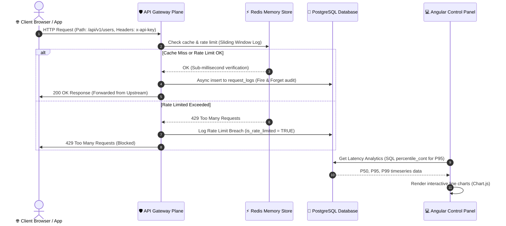

# 🛡️ GateKeeper — Glassmorphic API Gateway Control Plane
### *Enterprise-Grade Dynamic Routing, Redis-Backed Rate Limiting & Real-Time Telemetry Analytics*

<div align="center">

[](https://angular.dev/)
[](https://dotnet.microsoft.com/)
[](https://github.com/DapperLib/Dapper)
[](https://www.postgresql.org/)
[](https://redis.io/)
[](https://www.chartjs.org/)
[](https://jwt.io/)

**GateKeeper** is an enterprise-grade administrative Control Plane for API Gateways. It provides backend developers and system administrators with a unified dashboard to provision route mappings, enforce dynamic rate limits across multiple algorithms (Token Bucket, Sliding Window, Fixed Window), manage hashed client API credentials, and monitor live traffic telemetry. 

The application features a cutting-edge **Glassmorphic visual aesthetic** featuring reactive UI layouts, smooth backdrop-blur animations, and instant cached page transitions.

</div>

---

## 📖 Table of Contents
1. [🌟 The "Why": Problem & Solution](#-the-why-problem--solution)
2. [🏗️ Architectural Flow](#️-architectural-flow)
3. [⚙️ Tech Stack & Key Technologies](#️-tech-stack--key-technologies)
4. [💡 Core Features & Technical Deep-Dive](#-core-features--technical-deep-dive)
    * [🎨 Glassmorphism & Adaptive Design System](#-glassmorphism--adaptive-design-system)
    * [⚡ High-Performance Data Access (Dapper vs. EF Core)](#-high-performance-data-access-dapper-vs-ef-core)
    * [🔑 Secure API Key Management (SHA-256 Hashing)](#-secure-api-key-management-sha-256-hashing)
    * [📈 PostgreSQL Telemetry & P95 Analytics](#-postgresql-telemetry--p95-analytics)
    * [🚀 Redis Caching & Invalidation Patterns](#-redis-caching--invalidation-patterns)
5. [💎 Why This Project Stands Out (For Recruiters)](#-why-this-project-stands-out-for-recruiters)
6. [🚦 Getting Started & Configuration](#-getting-started--configuration)
7. [📂 Core Directory Structure](#-core-directory-structure)
8. [📜 License](#-license)

---

## 🌟 The "Why": Problem & Solution

### ❌ The Problem
As modern microservices scale, managing API gateways becomes complex. Upstream route targets change, client traffic spikes overwhelm servers, and database logging blocks request threads.
* **Stale Routing**: Traditional gateways require manual JSON configurations or server restarts to apply new routes.
* **Vulnerable Secrets**: Plaintext API keys stored in databases are vulnerable to security leaks.
* **Slow Analytics**: Querying millions of request logs for raw response latency metrics (like P95 and P99 percentiles) locks transactional tables.
* **Slow Dashboards**: Frequent polling of gateway settings burdens the database with redundant operations.

### ✅ The GateKeeper Solution
GateKeeper solves these issues by decoupling the **Control Plane (Management)** from the **Data Plane (Routing/Rate Limiting)**, offering:
1. **Dynamic Hot-Reload Configs**: Instantly register paths and assign allowed HTTP verbs (GET, POST, etc.) via a secure control panel.
2. **Sub-Millisecond Threat Shield**: Configurable rate limit rules (Global, IP, or Key-based) using memory-optimized structures to block unauthorized clients before hitting upstream APIs.
3. **Optimized Analytics Pipeline**: High-performance SQL queries aggregated by time-buckets alongside indexed UUID audit logs.
4. **Client & Server Caching**: Utilizes RxJS BehaviorSubjects on the client and Redis caching on the server to make transitions between routes, configurations, and analytical views occur **instantly** (< 20ms).

---

## 🏗️ Architectural Flow

The diagram below details how clients access upstream services, how credentials and rate limits are verified via Redis, and how the administrative dashboard fetches analytics:



---

## ⚙️ Tech Stack & Key Technologies

### 💻 Frontend (Client Dashboard)
* **Angular 18**: High-performance Single Page Application (SPA) structure utilizing strict type safety and modular components.
* **RxJS States**: Uses `BehaviorSubject` cache wrappers to manage configuration states, avoiding redundant HTTP calls when switching dashboard tabs.
* **Chart.js**: Dynamic, canvas-rendered dashboard charts for live network telemetry.
* **Vanilla CSS3**: Tailored layout engine featuring modern HSL custom styling variables, frosted glass panels (`backdrop-filter: blur(16px)`), responsive grid models, and smooth ambient float-glow animation meshes.

### ⚙️ Backend (API Core Control Plane)
* **ASP.NET Core Web API (.NET 10.0)**: The latest, high-performance C# framework configured with dependency injection, global exception handlers, and JWT Bearer security.
* **Dapper Micro-ORM**: High-speed database mapping designed to bypass Entity Framework Core's query translation overhead, executing queries near raw ADO.NET performance.
* **StackExchange.Redis**: Real-time integration supporting local Redis configuration and secure `rediss://` SSL connection string schemes for cloud cache systems (e.g. Upstash).
* **Npgsql**: High-performance ADO.NET driver mapping for PostgreSQL.
* **BCrypt.Net-Next**: Secure password hashing algorithms for administrator credentials.

---

## 💡 Core Features & Technical Deep-Dive

### 🎨 Glassmorphism & Adaptive Design System
The frontend implements a custom-designed user interface. Instead of standard white or grey boxes, it applies a **Glassmorphism design language**:
* **Aesthetic Tokens**: Frosting effects utilize `backdrop-filter: blur(12px)` combined with subtle translucent borders (`rgba(255, 255, 255, 0.08)`).
* **Ambient Glow Points**: Dynamic CSS `@keyframes` handle two background-blur glow meshes (`floatGlow` and `floatGlowReverse`) that simulate depth and responsive movement behind panels.
* **Double-Toggle Theme Engine**: Instant transitions between **Dark Mode** (carbon glass with cyan & indigo glows) and **Light Mode** (frosted white acrylic with charcoal typography and pastel ambient meshes). Preferences are persisted using the browser's `localStorage`.

```css
/* Ambient glow meshes sitting in the background to create depth */
body::before {
  content: "";
  position: absolute;
  top: 15%; left: 20%; width: 45vw; height: 45vw;
  background: radial-gradient(circle, var(--accent-violet-glow) 0%, transparent 70%);
  z-index: -2;
  filter: blur(80px);
  pointer-events: none;
  animation: floatGlow 12s ease-in-out infinite alternate;
}
```

---

### ⚡ High-Performance Data Access (Dapper vs. EF Core)
By opting for **Dapper** instead of Entity Framework Core, the project achieves minimal latency and optimal database mapping control:
* **Connection Management**: Instantiated via a custom [DbConnectionFactory](file:///c:/Users/USER/Desktop/Sai%20SDE%20Projects/GateKeeper/GateKeeper-API-Gateway-with-Rate-Limiting-Analytics/server/Database/DbConnectionFactory.cs) using PostgreSQL connection pools.
* **Snake Case Auto-Mapping**: Programmatic configuration using `Dapper.DefaultTypeMap.MatchNamesWithUnderscores = true` to map Postgres `snake_case` fields to C# `PascalCase` objects automatically.
* **Transaction Bounds**: Database updates are executed within transactional scopes to guarantee ACID compliance during multi-row operations.

---

### 🔑 Secure API Key Management (SHA-256 Hashing)
To secure upstream client access:
* **Hashed Storage**: The backend never stores API keys in plaintext. When an administrator generates a client key, the plaintext token (e.g. `gk_live_8f3d...`) is shown once.
* **Prefixing**: A prefix (e.g. `gk_live_`) and a key label are stored in PostgreSQL for easy administrative lookup.
* **One-Way Cryptography**: The key is immediately hashed using SHA-256. Subsequent authentication requests hash the client's header key and compare it directly to database records, protecting client credentials.

---

### 📈 PostgreSQL Telemetry & P95 Analytics
Calculating metrics from request logs is optimized for speed and accuracy. Rather than parsing raw data on the server, GateKeeper handles calculations directly on the database using PostgreSQL aggregate functions:
* **Percentile Aggregations**: Uses PostgreSQL's `percentile_cont(0.50)`, `percentile_cont(0.95)`, and `percentile_cont(0.99)` inside `WITHIN GROUP (ORDER BY latency_ms)` to calculate accurate P50, P95, and P99 latency timeseries.
* **Time-Bucket Truncation**: Groups historical error rates by the hour using `date_trunc('hour', timestamp)` to output lightweight graph coordinate arrays.

```sql
SELECT
    path AS Route,
    COUNT(*)::int AS RequestCount,
    percentile_cont(0.50) WITHIN GROUP (ORDER BY latency_ms) AS P50Ms,
    percentile_cont(0.95) WITHIN GROUP (ORDER BY latency_ms) AS P95Ms,
    percentile_cont(0.99) WITHIN GROUP (ORDER BY latency_ms) AS P99Ms
FROM request_logs
WHERE gateway_id = @GatewayId
GROUP BY path
ORDER BY RequestCount DESC;
```

---

### 🚀 Redis Caching & Invalidation Patterns
To maintain sub-20ms dashboard performance:
* **Cache Eviction**: Gateway configurations and user lists are cached under prefix keys like `gateway:{id}` and `gateways:user:{userId}` with a 30-minute Time-To-Live (TTL).
* **Write-Through Invalidation**: Mutation endpoints (e.g., creating routes, updating statuses, deleting gateways) automatically trigger cache evictions. This prevents stale configurations from loading while minimizing backend database lookups.
* **Client Cache Sync**: RxJS BehaviorSubjects in services like `GatewayService` sync layout configurations instantly across components, making route changes reflect immediately on the frontend.

---

## 💎 Why This Project Stands Out (For Recruiters)

This project showcases several advanced backend and frontend engineering patterns:
* **Data Privacy Best Practices**: API keys are securely hashed using SHA-256 and stored with custom labels, following industry standards like Stripe and GitHub.
* **Dapper Mapping Control**: Bypasses ORM overhead by writing manual SQL queries, showing a solid understanding of database design and index optimization.
* **System Resilience**: Includes a custom transactional startup [MigrationRunner](file:///c:/Users/USER/Desktop/Sai%20SDE%20Projects/GateKeeper/GateKeeper-API-Gateway-with-Rate-Limiting-Analytics/server/Database/MigrationRunner.cs) that handles database schemas programmatically without depending on external tools.
* **Database Optimization**: Uses database-level aggregations (`percentile_cont`, indexes on `gateway_id` and `timestamp`) to generate statistics efficiently.
* **State Management**: Implements clean state synchronization using RxJS variables, avoiding redundant API calls and page refresh cycles.

---

## 🚦 Getting Started & Configuration

### 📋 Prerequisites
* [.NET Core SDK 10.0+](https://dotnet.microsoft.com/en-us/download)
* [Node.js v20+ / NPM](https://nodejs.org/)
* PostgreSQL Database Server running locally or in the cloud.
* Redis Key-Value Store running locally or in the cloud.

---

### 🛠️ Backend Setup & Configuration

1. **Configure Connection Strings**  
   Open [server/appsettings.json](file:///c:/Users/USER/Desktop/Sai%20SDE%20Projects/GateKeeper/GateKeeper-API-Gateway-with-Rate-Limiting-Analytics/server/appsettings.json) and enter your PostgreSQL credentials and Redis connection endpoint (supports local `localhost:6379` or cloud `rediss://...`):
   ```json
   {
     "ConnectionStrings": {
       "DefaultConnection": "Host=localhost;Database=GateKeeperDb;Username=postgres;Password=your_db_password",
       "Redis": "localhost:6379"
     },
     "JwtSettings": {
       "Secret": "A_Very_Long_Super_Secure_HMAC_SHA256_Secret_Key_For_Jwt_Generation_32_Bytes",
       "Issuer": "GateKeeperIssuer",
       "Audience": "GateKeeperAudience"
     }
   }
   ```

2. **Boot the Backend Server**  
   Navigate to the `server` directory. The custom transactional startup runner will automatically execute database migrations:
   ```bash
   cd server
   dotnet run
   ```
   The backend server will run on `http://localhost:5041` with OpenAPI Swagger docs available.

---

### 💻 Frontend Setup & Configuration

1. **Install Angular Dependencies**  
   Navigate to the `client` directory and install the required NPM packages:
   ```bash
   cd client
   npm install
   ```

2. **Start the Frontend Application**  
   Run the development server:
   ```bash
   npm run start
   ```
   Open your browser and navigate to `http://localhost:4200` to register your administrator account.

---

## 📂 Core Directory Structure

The repository is structured to separate concern layers between the backend API and the Angular SPA dashboard:

```text
├── client/                     # Angular 18 Frontend
│   ├── src/
│   │   ├── app/
│   │   │   ├── components/     # Dashboard, Login, API-Key, Alerts components
│   │   │   ├── guards/         # Auth verification guards
│   │   │   ├── interceptors/   # JWT bearer token injection interceptor
│   │   │   ├── services/       # State caches (RxJS BehaviorSubjects) & API clients
│   │   └── styles.css          # Glassmorphic Design Token System
└── server/                     # ASP.NET Core 10 Web API Backend
    ├── Database/
    │   ├── Migrations/         # SQL schema migrations (V1 to V9)
    │   ├── DbConnectionFactory.cs # Thread-safe connection instantiation
    │   └── MigrationRunner.cs  # startup migration executor
    ├── Controllers/            # API endpoints (Auth, Analytics, Gateway CRUD)
    ├── Models/
    │   ├── Entities/           # Database schema mappings (User, Gateway, APIKey)
    │   └── DTOs/               # Strongly-typed request/response validation contracts
    ├── Repositories/           # Database queries mapping to Dapper
    ├── Services/               # Core business rules & cache wrappers
    └── Program.cs              # Web application bootstrapper & Dependency Injection
```

---

## 📜 License
This project is licensed under the MIT License - see the [LICENSE](file:///c:/Users/USER/Desktop/Sai%20SDE%20Projects/GateKeeper/GateKeeper-API-Gateway-with-Rate-Limiting-Analytics/LICENSE) file for details.
