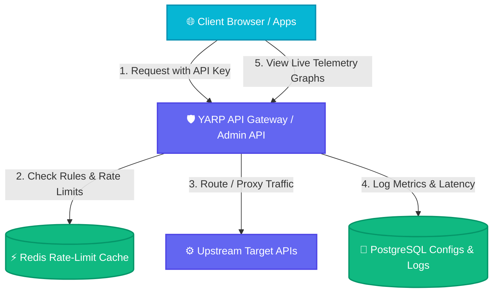

# 🛡️ GateKeeper — Glassmorphic API Gateway with Rate Limiting & Analytics

<div align="center">


**GateKeeper** is an enterprise-grade API Gateway Control Plane. It leverages **Microsoft YARP (Yet Another Reverse Proxy)** to route client requests dynamically, enforces state-of-the-art **IP & API key rate limiting** backed by Redis, and generates real-time telemetry metrics stored in PostgreSQL. The entire control dashboard is wrapped in a premium **Glassmorphism design language** with responsive toggles, dynamic live charts, and seamless theme switching.

</div>

---

## 🏗️ Architectural Flow

The following diagram illustrates how clients authenticate, YARP forwards traffic upstream, and the Angular dashboard pulls analytics asynchronously:



---

## ✨ Features

### 🌌 Frosted Glassmorphism UI
- Fully responsive interface featuring frosted glass panels (`backdrop-filter`), floating neon glows (indigo, cyan, pink), and smooth micro-animations.
- **Double-Toggle Theme Support**: Toggle between Dark and Light mode instantly. Light mode utilizes a premium frosted acrylic theme with matching color parameters for readability.

### ⚡ Supercharged Client-Side Caching
- **RxJS BehaviorSubjects** and custom memory cache stores prevent redundant HTTP calls.
- Transitions between tabs (Overview, Routes, Rate Limits, Alerts, Live Charts, Logs) occur **instantly** without page-load delays.
- Mutation endpoints automatically trigger regex-based cache invalidation to keep visual data perfectly accurate.

### ⚙️ YARP Dynamic Routing
- Define route catchments and matching prefixes on the fly.
- Configurable **Strip Prefix** filters so matching routes are cleaned before forwarding upstream.

### 🛡️ Rate Limiting & Threat Shield
- Create Global or IP-specific rate limits.
- Supports **Sliding Window Log**, **Fixed Window**, and **Token Bucket** algorithms.
- Rate-limiting rules are evaluated instantly inside Redis memory stores to achieve sub-millisecond overhead.

### 📊 Real-Time Analytics & Logs Trace
- Real-time charting powered by **Chart.js** displaying success rates, HTTP 429 status code counts, response latencies (Average and P95), and status distributions.
- Paginated log viewer with search filter categories (2xx success, 429 limited, 5xx server errors).

---

## 🚦 Getting Started

### Prerequisites
- [.NET Core SDK 10.0+](https://dotnet.microsoft.com/en-us/download)
- [Node.js v20+ / NPM](https://nodejs.org/)
- PostgreSQL Server and Redis Server running locally.

---

### 💻 Running the Control Plane

#### 1. Setup Database Connections
Update `server/appsettings.json` with your local PostgreSQL and Redis connections:
```json
{
  "ConnectionStrings": {
    "DefaultConnection": "Host=localhost;Database=GateKeeperDb;Username=postgres;Password=yourpassword"
  },
  "Redis": {
    "Configuration": "localhost:6379"
  }
}
```

#### 2. Start the ASP.NET Core Backend
Navigate to the `server` directory, apply EF Core migrations, and run:
```bash
cd server
dotnet ef database update
dotnet run
```
The server will boot on `http://localhost:5041` with OpenAPI Swagger UI docs.

#### 3. Start the Angular Client
Navigate to the `client` directory, install packages, and launch:
```bash
cd client
npm install
npm run start
```
Open your browser and navigate to `http://localhost:4200` to register your administrator account!

---

## 🎨 Theme Preview

- **Dark Mode**: Translucent grey-on-dark panels displaying cyan and purple glow points.
- **Light Mode**: Translucent white-on-slate containers showing charcoal details and pastel ambient overlays.
- Both themes store preference keys inside the browser's `localStorage` to ensure a persistent user experience.

---

## 📜 License
This project is licensed under the MIT License - see the LICENSE file for details.
